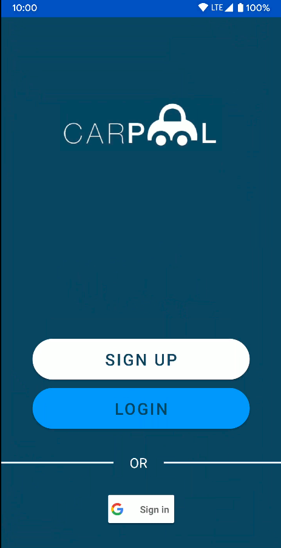
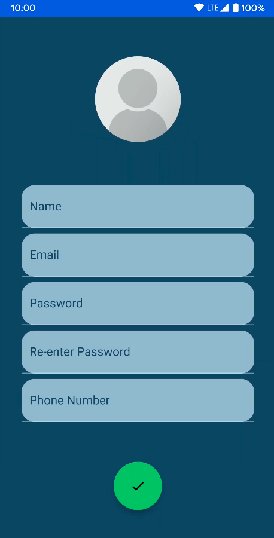
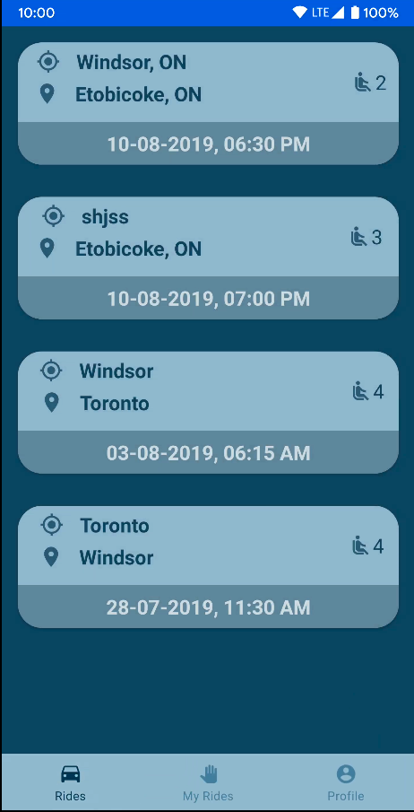
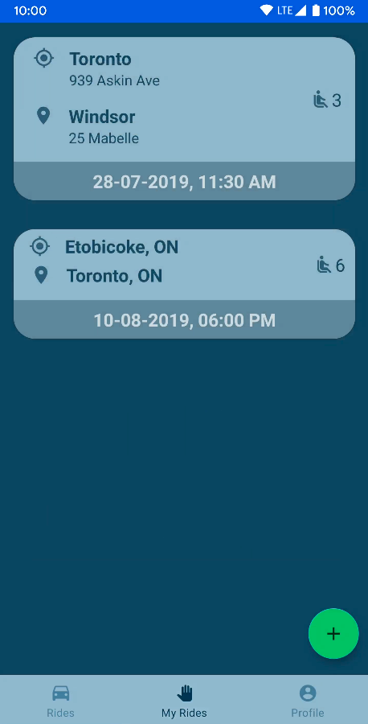
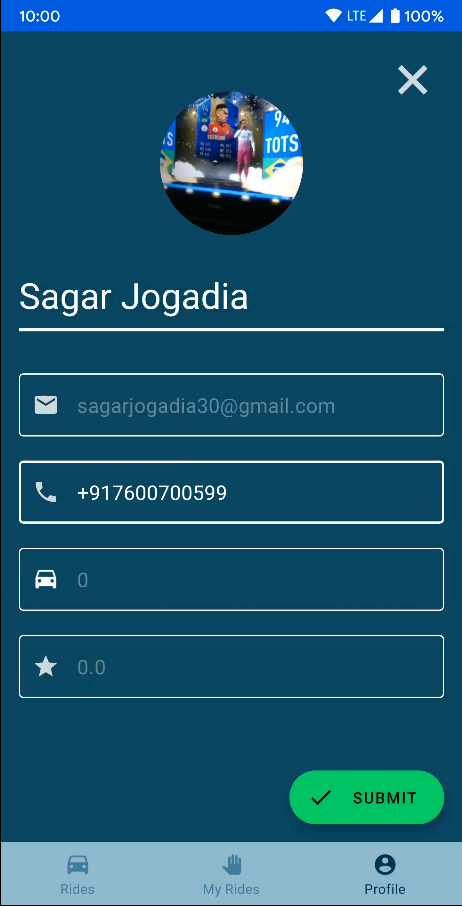
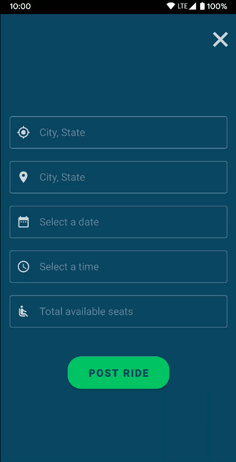
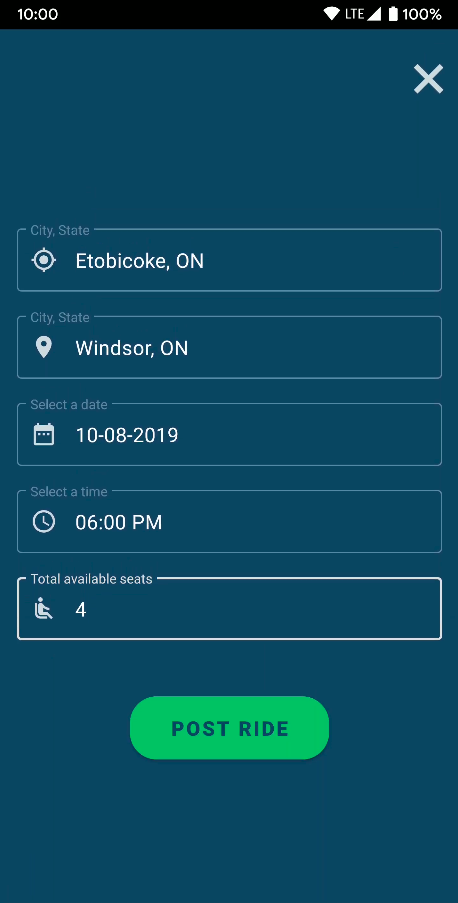
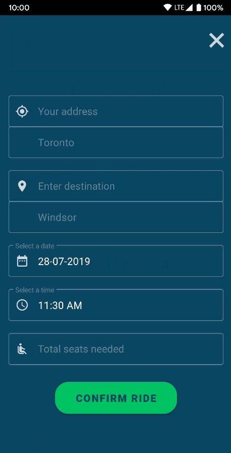
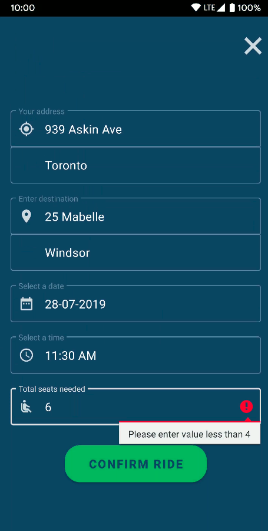

# About the Project

Carpool is an Android application created to provide ease to regular riders in different parts of Ontario which allows users to share the ride with others by posting advertisement for rides. The application lets users share the commuting costs with other persons heading the same way.

> Acts as a centralized system for carpooling without relying on different chat groups and individual messaging to share a ride.

# Built With

- [Java](https://java.com/en/)
- [XML](https://www.w3schools.com/xml/xml_whatis.asp)
- [Firebase](https://firebase.google.com/)

# Features

- Uses Firebase authentication for the convenience of user verification and simple verification once registered.
- Implemented Firebase real-time database to store the information of the user and rideshare postings for a secure way of handling sensitive data like names, contact numbers, and emails.
- Provides real-time booking of rides and updates the filled seats accordingly on the fly.
- Allows users to update or remove the rides by swiping left on the screen.

# Screenshots
  
- Splash screen when user launches the application

- User can login or create a new profile

- User needs to provide a new email address in order to signup, else the application will not create new user and will show a toast message to user

- When the user is logged in, the application has 3 seperate tabs:
  - <b>Rides:</b> All the rides posted by the drivers
  
    

  - <b>My Rides:</b> All the rides posted or requested by the user
  
    

  - <b>Profile</b>: To view or edit the user details
  
    

- From the <b>My Rides</b>, user can a post a new ride by clicking on <b>+</b> button.

  

- From the <b>Rides</b>, user can click on any ride and confirm their ride by providing their information.

  

# Contact

- Sagar Jogadia: sagarjogadia28@gmail.com
- Project Link: https://github.com/sagarjogadia28/CarPool
